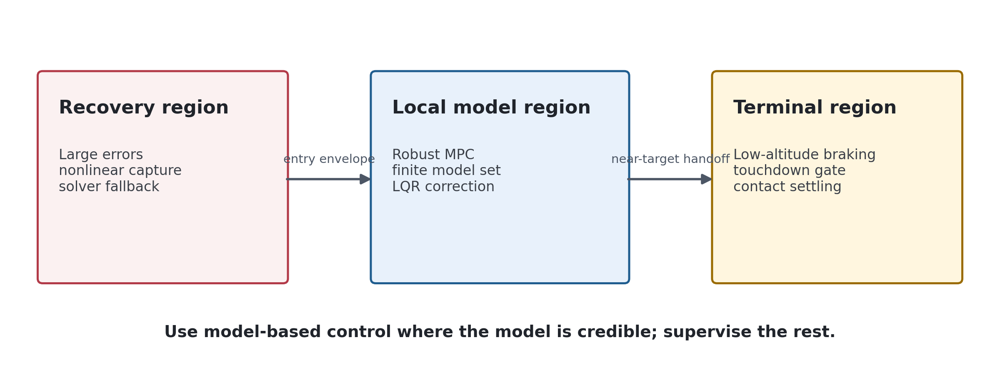
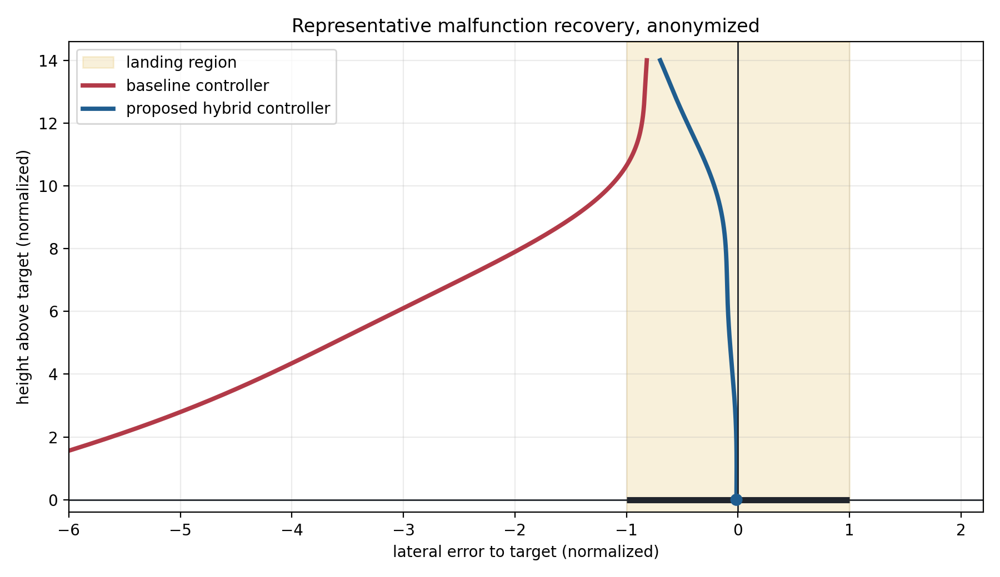

# Robust Landing Control Under Actuator Uncertainty

This is a sanitized portfolio case study based on a university control project.
Course materials, simulator code, assignment files, notebooks, validation scripts,
and runnable submission code are intentionally omitted.

## Problem

The task was to design a landing controller for a simulated rocket descending
toward a moving target under uncertain actuation and mass properties. The
baseline controller could handle an easy nominal descent, but degraded actuator
authority and off-nominal approach states exposed a lack of robustness.

## Approach

The final design used a hybrid control architecture:

- **Robust MPC in the local corridor** to plan constrained actions over a finite
  model set representing degraded and nominal actuation.
- **Local LQR feedback** to add small stabilizing corrections around the
  model-predictive command.
- **Recovery supervision** to handle states outside the credible linear-model
  region.
- **Terminal logic** to manage low-altitude braking and contact-sensitive
  touchdown behavior.

## Representative Result

In representative malfunction cases, the baseline controller drifted away from
the target, while the proposed hybrid controller recovered into the landing
region. The figure below is an anonymized, non-reproducible summary intended to
communicate the engineering result without exposing assignment-specific
parameters or solution code.

## Why This Was Interesting

- The controller had to respect actuator limits rather than relying only on
  hand-tuned feedback.
- Robustness depended on modeling uncertainty explicitly, not only retuning a
  nominal controller.
- The most difficult behavior occurred near touchdown, where a linear flight
  model no longer describes contact physics well.

## Limitations

- This was a simulator project, not a flight-certified control system.
- The public version omits the simulator, assignment, exact validation cases,
  controller constants, and runnable code.
- The reported behavior should be understood as evidence from a controlled
  simulation study, not as a formal guarantee for a physical vehicle.

