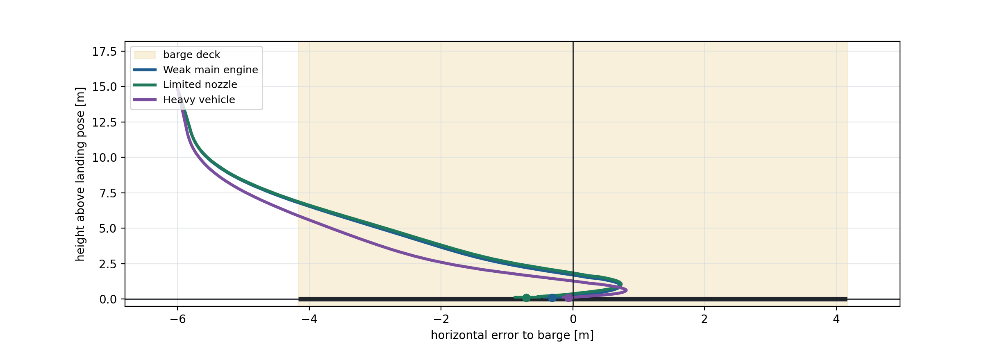

# Robust Landing Control Under Actuator Uncertainty

I designed and evaluated a hybrid landing controller for a simulated rocket
subject to actuator degradation, mass uncertainty, and off-nominal approach
states.

The controller combines finite-model constrained MPC, ancillary LQR feedback,
nonlinear recovery supervision, and dedicated touchdown logic. In the final
evaluation, it achieved successful two-leg landings in all three withheld
malfunction scenarios.

This repository is a sanitized technical case study. Course-provided software,
exact controller constants, test scenarios, and runnable submission code are
intentionally omitted.

## Problem

The task was to control a simulated rocket descending toward a moving landing
target. A nominal baseline controller could handle easier descent cases, but
degraded actuator authority and larger initial deviations exposed a lack of
robustness.

The main control challenge was to combine:

- recovery behavior when the vehicle was outside the local model region,
- constrained landing control near the target,
- robustness against actuator and model uncertainty,
- and careful low-altitude touchdown behavior.

## My Contribution

I was responsible for the controller design, implementation, tuning, and
simulation-based evaluation. The main contributions were:

- modeling actuator uncertainty with a finite set of effective input-gain models,
- implementing a shared-input constrained MPC across those models,
- combining MPC with local LQR correction and nonlinear recovery supervision,
- and diagnosing the terminal drop failure that motivated the touchdown and
  contact-settle logic.

## Controller Architecture

The final design used a hybrid control architecture:

- **Recovery supervision** outside the local landing corridor, where the
  linearized model is not reliable.
- **Robust MPC** inside the local corridor, planning constrained actions over a
  finite set of plausible actuator-effectiveness models.
- **Local LQR feedback** around the predictive command, using the structure
  `u_k = v_k + L x_k`.
- **Terminal touchdown logic** for low-altitude braking and contact-sensitive
  behavior.
- **Contact-settle logic** after touchdown to avoid aggressive lateral or
  gimbal commands.


## Evaluation

**Achieved two-leg landings in all three withheld malfunction tests, with the
fastest end-to-end evaluation among the 124 full-credit submissions, from 191
submissions overall.**

End-to-end evaluation refers to execution of the complete evaluation notebook,
not an individual MPC solve. This is empirical project-benchmark evidence, not
a global robustness guarantee.

## Recorded Controller Output

The plot below shows recorded closed-loop trajectories from the final controller
under three representative malfunction classes. The shaded region is the deck
footprint and the markers indicate the final positions. Exact scenario settings
are omitted, but the curves and physical units come directly from simulator
output rather than illustrative data.



## Public Architecture Reference

The executable
[supervisor reference](src/hybrid_landing_supervisor_reference.py) demonstrates
the software boundary around the controller. It implements:

- mode selection between recovery, local MPC, terminal, and contact-settle
  behavior,
- hysteresis before the local predictive policy receives control authority,
- fallback when the predictive policy cannot provide a valid command,
- a generic representation of terminal touchdown commitment,
- handoff to a bounded contact-settle policy,
- and normalized actuator saturation.

Recovery, MPC/LQR, terminal, and contact-settle policies are injected through
generic interfaces. The reference therefore tests the hybrid architecture
without reproducing the course simulator, optimization problem, controller
gains, or submitted APIs. The sanitized controller formulation is documented
separately in the [control formulation](docs/control_formulation.md).

Run the dependency-free supervisor tests with:

```bash
python3 -m unittest discover -s tests -v
```

## Technical Scope

**Control:** finite-model robust MPC, LQR, hybrid supervisory control, online
actuator-effectiveness estimation, and constrained touchdown control.

**Implementation:** Python, CVXPY/OSQP, simulation-based validation, failure
analysis, and testable policy interfaces.

## Scope

This was a simulator study, not a flight-certified control system. The public
repository intentionally omits the simulator, exact validation cases,
controller constants, model matrices, and runnable submission code; see the
[disclosure boundary](DISCLAIMER.md).
